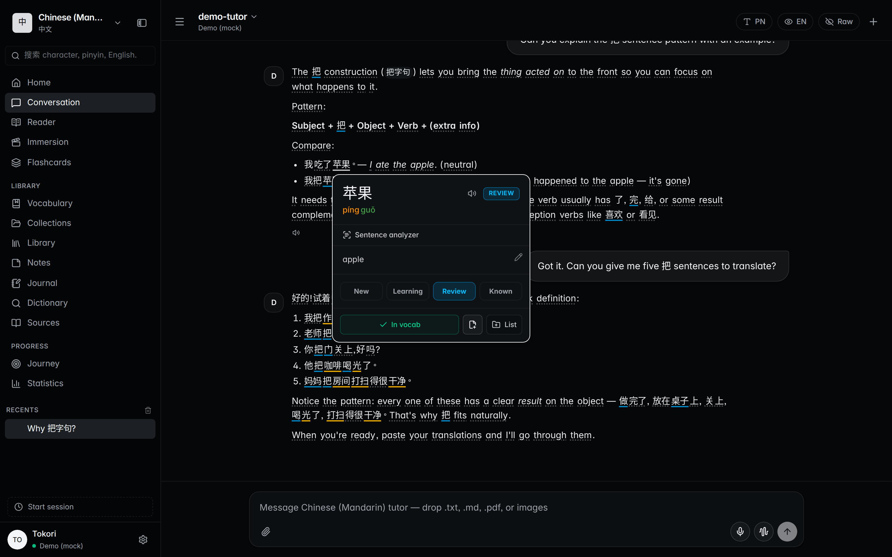
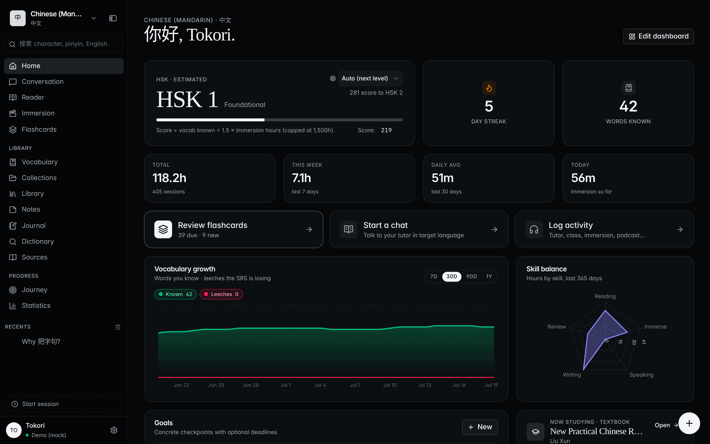
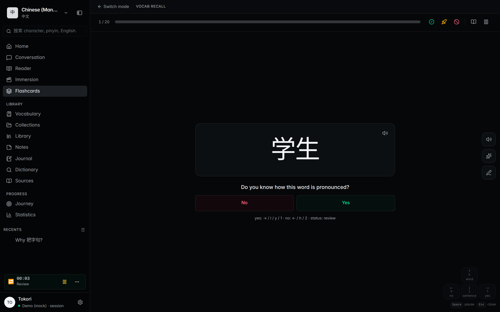
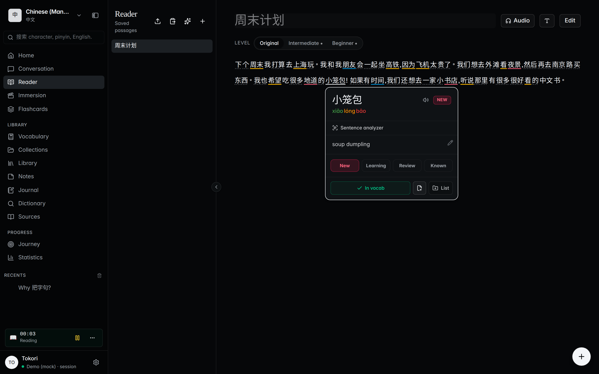
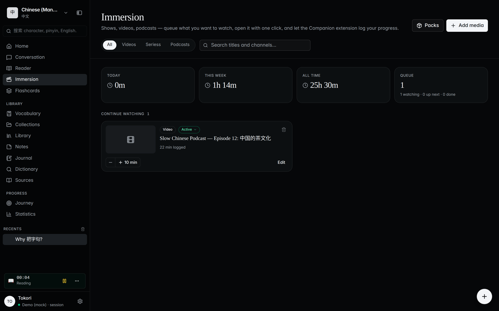

<p align="center">
  
</p>

<h1 align="center">Tokori</h1>

<p align="center">
  A <strong>local-first AI tutor</strong> for language learners — chat in your target language, click any word to define and save it, review it with spaced repetition.
  <br />
  <a href="https://tokori.ai"><strong>Try the live demo →</strong></a>
</p>

<p align="center">
  <a href="https://github.com/tokoriai/tokori/actions/workflows/ci.yml"></a>
  <a href="https://tokori.ai/docs/"></a>
  <a href="LICENSE"></a>
  
</p>

<!--
  DEMO VIDEO — to add a clip above the screenshot: open this file in the
  GitHub web editor (github.com/tokoriai/tokori/edit/main/README.md) and
  drag a short MP4 (H.264, ~30–60 s, ideally <10 MB) into the editor.
  GitHub uploads it and inserts a `https://github.com/user-attachments/
  assets/<uuid>` URL that renders as an inline <video> player on the repo
  page. A plain link to a raw .mp4 does NOT auto-embed — the drag-and-drop
  upload flow is what produces the player.
-->



## What it does

**Tokori** is a desktop workspace for serious language learning, built around the loop that actually works: read and listen a lot, look up what you don't know, and let spaced repetition keep it. The AI tutor writes in your target language; every word it produces is one click away from a definition and one more from your flashcard deck.

- **Local-first.** Workspaces, vocab, chats, and stats live in a SQLite file on your disk. No account, no telemetry, works offline.
- **Bring your own model.** Ollama, OpenAI, Anthropic, Gemini, OpenRouter, or MiniMax — API keys stay on your machine and only ever go to the provider you configured.
- **Click-to-define everywhere.** Chat, reader, and notes all share the same word popover: pronunciation, gloss, status, save-to-vocab. Backed by CC-CEDICT, JMdict, and other open dictionaries, plus your own imports.
- **FSRS flashcards, five study modes.** Vocab recall, sentence cards, sentence mining, typed recall, and handwriting practice with real-time stroke-order corrections.
- **A reader that meets your level.** Import a book, article, or YouTube transcript; the AI can rewrite any passage at Intermediate or Beginner difficulty, with TTS audio.
- **Immersion tracking.** A watch shelf for videos, series, and podcasts — the Companion browser extension logs your YouTube time automatically, and the dashboard turns it into streaks, skill balance, and an HSK / JLPT / TOPIK / CEFR estimate.
- **Scriptable.** A local HTTP API and bundled MCP server let agents and external tools read workspaces and write vocab. Anki-style addons extend study modes, importers, and translators.

| Dashboard | Flashcards |
| --- | --- |
|  |  |

| Reader | Immersion |
| --- | --- |
|  |  |

## Install

Pre-built binaries for macOS (`.dmg`), Windows (setup `.exe`), and Linux (`.deb` / `.rpm` / AppImage) are on the [Releases page](https://github.com/tokoriai/tokori/releases).

```sh
sudo apt install ./tokori_*.deb     # Debian / Ubuntu
sudo dnf install ./tokori-*.rpm     # Fedora / RHEL
yay -S tokori-bin                   # Arch (AUR)
```

…or the one-line installer (auto-detects `.deb` / `.rpm`, else falls back to the portable AppImage):

```sh
curl -fsSL https://tokori.ai/install.sh | bash
```

Per-platform notes (first-launch quarantine bypass, AppImage, data location) live in the [install guide](https://tokori.ai/docs/guides/install).

## Quickstart

1. Launch Tokori and pick your **target language** + **native language**.
2. Open **Settings → Providers**, add a provider (e.g. Ollama at `http://localhost:11434`), and click **Use**.
3. Open **Conversation**, type something in your target language, and click any word in the reply to define it. Click **+** to save it.
4. Open **Flashcards** to review saved words on the FSRS schedule.

The full walk-through is in the [quickstart guide](https://tokori.ai/docs/guides/quickstart).

## Build from source

You need Node 20+, Rust stable (1.85+), and [Tauri's platform dependencies](https://tauri.app/start/prerequisites/).

```sh
git clone https://github.com/tokoriai/tokori.git
cd tokori
npm install

npm run tauri dev      # full desktop app (slow first compile)
npm run dev            # browser-only UI on http://localhost:5173

npm run tauri build    # release bundle → src-tauri/target/release/bundle/
```

More detail in the [build-from-source guide](https://tokori.ai/docs/guides/build-from-source) and the [architecture overview](https://tokori.ai/docs/guides/architecture).

## Documentation

Guides for [providers](https://tokori.ai/docs/guides/providers), [dictionaries](https://tokori.ai/docs/guides/dictionaries), [vocabulary & SRS](https://tokori.ai/docs/guides/vocabulary), the [reader](https://tokori.ai/docs/guides/reader), [addons](https://tokori.ai/docs/guides/addons), the [MCP server](https://tokori.ai/docs/guides/mcp), and the [HTTP API reference](https://tokori.ai/docs/reference/api) — the full table of contents lives at [tokori.ai/docs](https://tokori.ai/docs/).

## Project layout

```
src/                    React 19 + TypeScript frontend
  components/             UI (shadcn/ui + Tailwind 4)
  lib/                    State, providers, dict, FSRS, sync
src-tauri/              Rust shell (Tauri 2)
  src/commands.rs         Tauri IPC handlers
  src/api_server.rs       Local HTTP API (axum, bearer auth)
  src/providers.rs        LLM streaming pipeline
mcp-server/             MCP companion (Node, agent-facing)
docs/                   VitePress site (tokori.ai/docs)
test/                   Vitest suite
```

## Contributing

Issues and pull requests are welcome. Before opening a PR, run:

```sh
npm test
npm run build
cargo fmt --all -- --check       # in src-tauri/
cargo clippy --all-targets -- -D warnings
```

The contribution flow, coding conventions, and PR expectations live in [CONTRIBUTING.md](./CONTRIBUTING.md). To report a security issue privately, see [SECURITY.md](./SECURITY.md); community guidelines are in [CODE_OF_CONDUCT.md](./CODE_OF_CONDUCT.md).

## License

Tokori's own source is [AGPL-3.0-or-later](./LICENSE). It bundles CJK stroke-order data and downloads dictionaries that carry their own licenses — see [THIRD_PARTY_NOTICES.md](./THIRD_PARTY_NOTICES.md).

---

<p align="center">
  <a href="https://tokori.ai"><strong>● tokori</strong></a> — slow language learning.
</p>
